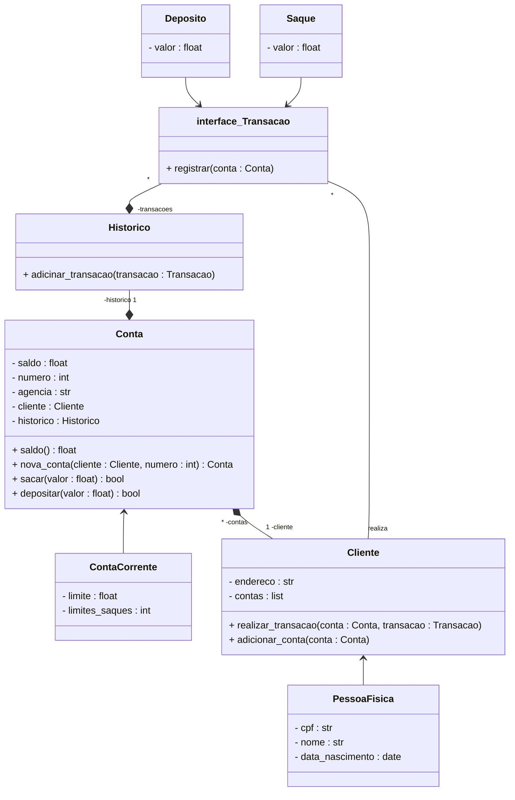

<h1>
    
     Bootcamp Python AI Backend Developer - VIVO
</h1>

##   Desafio de Projeto Modelando o Sistema Bancário em POO com Python

### Objetivo Geral

Iniciar a modelagem do sistema bancário em POO (Programação Orientada a Objetos). Adicionar classes para cliente a as operações bancárias: depósito e saque.

### Desafio

Atualizar a implementação do Sistema bancário, para armazenar os dados de clientes e contas bancárias em objetos ao invés de dicionários. O Código deve seguir o modelo de classe UML a seguir:

## Modelo de classe UML

### Desafio extra

Após concluir a modelagem das classes e a criação dos métodos. Atualizar os métodos que tratam as opções do menu para funcionarem com as classes modeladas.

### Ferramentas

### Utilitários

